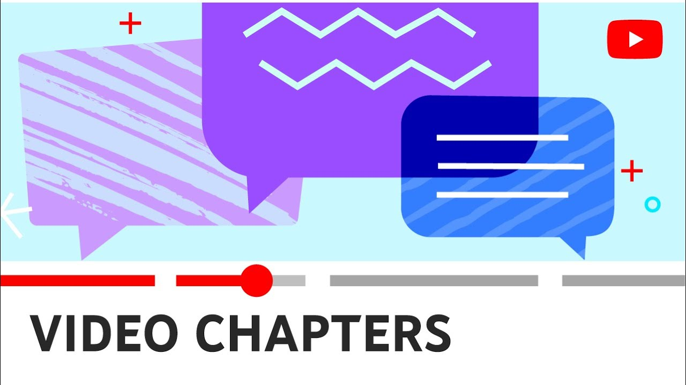

# YTCompDL, a Youtube Video Segmenter

---
Command-line program to download and segment Youtube videos automatically.

### Options

---
* Required:
  * url (-u) 
  * output (-o)
* Optional:
    * resolution (-r)
    * metadata (-m)
    * comment (-c)
    * timestamps (-t)
    * slice (-s)
    * fade (-f)
    * fade_time (-ft)

### Workflow

---
* Find timestamps in video description or comments.
* Download video and/or audio streams from Youtube.
* Process streams. 
    * Merge or convert streams.
    * Slice by timestamps found.
    * Apply file metadata.
    * Add audio and/or video fade.
* Cleanup 
    * Remove intermediate outputs.

